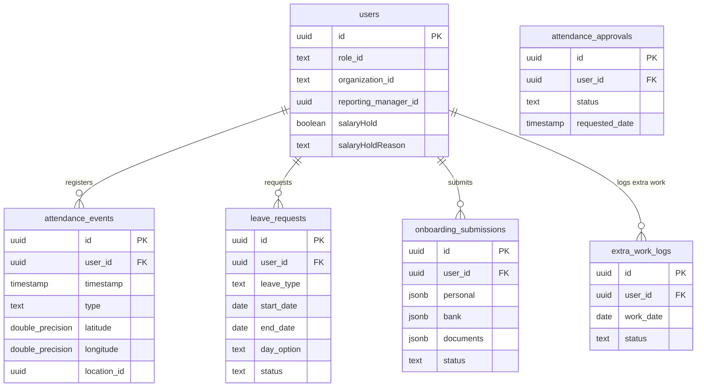

# Paradigm IFS 4.0 — HRMS Module Training & Technical Guide

This document provides a comprehensive operational and technical guide for the HRMS (Human Resource Management System) module in Paradigm IFS 4.0. It is designed to serve as both an **Operational Training Manual** for HR staff, admins, and managers, and a **Technical Reference** for developers extending the system.

---

## 1. System Overview

The HRMS module manages the entire employee lifecycle — starting from candidate recruitment and digital onboarding, moving through geofenced/face-verified attendance and leaves, and ending with payroll configuration and site allocations.

### Key Functional Pillars:
1. **Digital Onboarding Wizard:** A 9-step wizard for candidate document submission, verified instantly by Google Gemini Pro OCR to minimize human manual data entry errors.
2. **Geofenced & Biometric Attendance:** Geofenced check-in/out boundaries, face template matching using local WebAssembly models (`face-api`), and an offline synchronization queue.
3. **Leave & Comp-Off Management:** Leave tracking tabs, holiday selection pool management, compensatory off logs, and correction workflows.
4. **Site & Organization Configurator:** Hierarchical control mapping Groups -> Companies -> Societies/Entities (Client sites) with custom settings, shift rosters, and billing metrics.

---

## 2. End-User Guide (Role-Based Workflows)

### 2.1 For HR Managers & System Administrators
**Goal:** Oversee onboarding approvals, manage leave overrides, configure company/site rules, and perform audits.

#### 1. Candidate Onboarding Verification
- Navigate to the **Verification Dashboard**.
- View submissions marked as **Pending Verification** or **Requires Manual Review** (flagged by AI OCR mismatch).
- Compare the uploaded documents (Aadhaar, PAN, Cancelled Check) side-by-side with the candidate's input.
- Click **Approve** to authorize the profile and generate the employment contract PDF, or **Reject** (providing a standardized rejection reason) to send the form back to the candidate for corrections.

#### 2. Attendance & Leave Rules Configuration
- Navigate to **Attendance & Leave Rules** (`/hr/attendance-settings`).
- Select the scope (Global, Specific Location, Company, or Entity/Site).
- Configure settings across sub-tabs:
  - **General:** Set minimum hours required for a Full Day (e.g., 8 hrs) or Half Day (e.g., 4 hrs), and enable OT to Comp-Off conversions.
  - **Policies & Limits:** Toggle violation blocking (e.g., locking access after 3 consecutive attendance strikes), configure limits for permission hours per month, and set quotas for manual attendance corrections.
  - **Holidays:** Add specific holidays for a category (Office, Field, or Site Staff).
  - **Staff Selections:** Map system roles to categories (Office, Field, Site) to automate missed check-out runs.

#### 3. Leave approvals, Claims, & Corrections
- Navigate to **Leave Management** (`/hr/leave-management`).
- Use the tab system to manage requests:
  - **Pending Leaves:** Review and approve/reject leave requests from employees.
  - **Pending HR:** Finalize requests that have been approved by managers.
  - **Claims:** Approve or reject extra-work logs submitted for overtime/compensatory offs.
  - **Holiday Selection:** Modify holiday allocations for individual employees selected from the global pool.
  - **Corrections:** Review and resolve `pending_admin_correction` flags on attendance rows by manually adjusting punch timings.

---

### 2.2 For Employees & Field Staff
**Goal:** Self-onboarding, daily attendance punching, and leave applications.

#### 1. Completing the Onboarding Wizard
Candidates must complete the **9-step onboarding workflow** (`/onboarding`):
1. **Personal Information:** Name, DOB, contact details, marital status, and live profile photo capture.
2. **Address & KYC:** Present and permanent address inputs.
3. **Family Details:** Nominee settings, parents, spouse, and children specifications.
4. **Education & Experience:** Prior academic background and employment credentials.
5. **Bank Credentials:** Bank name, account number, IFSC code, and cancelled check upload.
6. **GMC & Insurance:** Medical policy selection and details.
7. **ESI & PF Configuration:** UAN numbers and ESI declarations.
8. **Uniform Sizing:** Pants, shirts, and shoe sizes for field deployment.
9. **Review & Sign:** Final review, Aadhaar signature verification, and submission.

#### 2. Geofenced & Face-Verified Attendance
- Open the Mobile/PWA home screen.
- Click **Check-In / Punch-In**.
- **GPS Check:** The system verifies if the device is within the geofenced circle (e.g., 50m radius) of the assigned site.
- **Biometric Face Match:** The front camera captures the user's face and matches it against the local descriptor vector cached on the device during onboarding.
- **Offline Mode:** If there is no internet connection, the check-in is logged to the device's local database. A yellow "Pending Sync" badge indicates it will auto-upload when a connection is restored.
- **Break Logs:** Log break intervals (Break Start / Break End). Insistent break reminders warn users via alarm or notification if breaks exceed standard limits.

---

## 3. Key Technical Highlights (Deep Dives)

### 3.1 AI OCR Verification Engine (Gemini Pro)
During onboarding submission (Step 9), the system passes document image URLs to the Google Gemini Pro API to perform optical character recognition (OCR) and cross-validation:
- **Aadhaar Validation:** Matches the text name, gender, and Aadhaar number printed on the card with the form input.
- **PAN Validation:** Validates the PAN format and matches the taxpayer name.
- **Bank Validation:** Analyzes the cancelled check image to parse the IFSC code and account number.
- **Verification Flag:** If the similarity score falls below `95%` or name tokens mismatch, the system sets `requiresManualVerification = true`, placing the candidate in the HR review queue.

### 3.2 Offline-First Outbox Synchronization
To handle remote sites with poor cell coverage, the application utilizes a hybrid local storage layer:
- **Web App:** Uses browser **IndexedDB** managed via the `idb` library.
- **Mobile App:** Uses native **SQLite** database via `@capacitor-community/sqlite`.
- **Outbox Queue Pattern:** All mutating offline actions are pushed to a local `outbox` table with status `pending`.
- **Sync Trigger:** A connection listener (`@capacitor/network`) triggers outbox synchronization immediately when returning online. Additionally, a background task attempts synchronization every 60 seconds.
- **Exponential Backoff:** If a synchronization fail occurs, the backoff interval doubles (max 5 retries) before marking the transaction as `failed`.

### 3.3 Attendance Evaluation Algorithm (`evaluateAttendanceStatus`)
Daily status codes are calculated in `utils/attendanceCalculations.ts` using the `evaluateAttendanceStatus` engine:
- **Status Key:**
  - `P` (Present), `3/4P` (Three-Quarter Day), `1/2P` (Half Day), `1/4P` (Quarter Day), `A` (Absent).
  - `W/O` (Weekly Off), `W/P` (Worked on Weekend), `H` (Holiday), `H/P` (Worked on Holiday).
  - `WFH` / `W/H` (Work From Home).
  - `S/L` (Sick Leave), `C/L` (Casual Leave), `E/L` (Earned Leave), `C/O` (Compensatory Off).
- **Weekend Off Eligibility (3-Day Presence Rule):**
  - Employees must accumulate at least **3 present days** (`Present` status) in the Mon-Sat period to qualify for a paid Sunday Weekend Off (`W/O`). If they do not meet this, Sunday is calculated as unpaid/absent.
- **Double Payable Days (`W/P` & `H/P`):**
  - If an employee checks in on a Sunday/Weekend (`W/P`) or configured Holiday (`H/P`), they receive **both** a Present credit (+1) AND preserve their baseline holiday entitlement, yielding **2 payable days** in the payroll sheet.
- **Operations Manager/Management Proximity Exemption:**
  - Operations Managers and top-tier management roles are exempted from strict GPS geofencing proximity checks. The rule resolver skips proximity bounds checking for these roles.

---

## 4. Developer Guide & Architecture

### 4.1 Database Schema (Supabase PostgreSQL)
The backend is powered by PostgreSQL schema defined in `supabase/schema.sql`:

#### Table Definitions:
- **`public.users`:** Maps user identities to their active role (`role_id`), assigned group/company (`organization_id`), and manager. Also manages salary-hold blocks.
- **`public.attendance_events`:** Logs checking-in/out, breaks, and GPS coordinates.
- **`public.onboarding_submissions`:** Stores onboarding steps details inside a unified JSONB column to support flexible additions without migrating the database.
- **`public.leave_requests`:** Tracks dates, leaves types, status (e.g. `pending_manager_approval`, `pending_hr_confirmation`, `approved`), and approval signatures.
- **`public.extra_work_logs` / `public.comp_off_logs`:** Tracks overtime hours and compensatory off balances.

### 4.2 State Management & API Layer
- **Zustand Client Stores (`store/`):**
  - `useAuthStore` (`authStore.ts`): User session, roles, checking-in state.
  - `useSettingsStore` (`settingsStore.ts`): Scoped attendance rules, holidays lists.
  - `useOnboardingStore` (`onboardingStore.ts`): Form steps drafts and files uploads state.
  - `useNotificationStore` (`notificationStore.ts`): Real-time notifications and system alerts.
- **CamelCase Translator (`services/api.ts`):**
  - Database schema columns are represented in `snake_case`, while the React frontend relies on `camelCase`.
  - All data queries going through the API client use `api.toCamelCase()` to automatically convert keys. Developers must ensure raw responses are mapped properly using this helper.

### 4.3 Security & RLS (Row-Level Security)
- **Frontend client:** Utilizes `VITE_SUPABASE_ANON_KEY`. Restricted by RLS policies so employees can only access their own attendance and leave records.
- **Serverless functions & Dev Proxy (`api/`):** Utilizes `SUPABASE_SERVICE_ROLE_KEY` to bypass RLS. This is used for operations like sending system emails, generating PDF onboarding contracts, and performing bulk corrections.
  - *Caution: Never prefix `SUPABASE_SERVICE_ROLE_KEY` with `VITE_` to prevent it from compiling into client bundles.*
