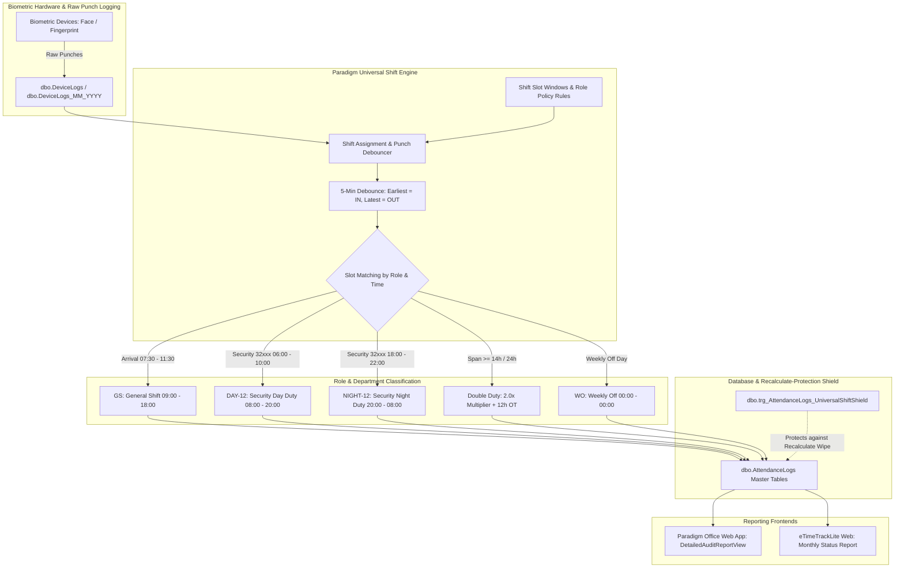

# Paradigm Universal Shift Engine & Attendance Reference Guide

> **Official Reference Document**: Master shift slot definitions, punch arrival windows, calculation formulas, double duty rules, and database shield architecture for **Paradigm Office** and **eTimeTrackLite**.

---

## 1. Architectural Data Flow & Single Source of Truth



---

## 2. Master Shift Slot Definitions & Window Rules

| Shift Code | Shift Name | Arrival / IN Window | Operational Shift Span | Multiplier | ShiftId (DB) | Applicable Roles / Departments |
| :---: | :--- | :---: | :---: | :---: | :---: | :--- |
| **GS** | General Corporate Shift | `07:30` – `11:30` | `09:00` to `18:00` (9h span) | **1.0** | **`5`** | Management, Utopia, Corporate, Office, Admin, Facility, Leads |
| **DAY-12** | Security Day Duty (12h) | `05:30` – `10:00` | `08:00` to `20:00` (12h span) | **1.0** | **`44`** | Security Guards & Supervisors (Day Shift) |
| **NIGHT-12**| Security Night Duty (12h)| `17:30` – `22:00` | `20:00` to `08:00` (+1d) | **1.0** | **`45`** | Security Guards (Anchored to Day 1 IN Date) |
| **A** | Technical Morning Shift | `05:00` – `11:30` | `07:00` to `15:00` (8h span) | **1.0** | **`2`** | MEP, Electricians, STP, Technical Site Staff |
| **B** | Technical Afternoon Shift| `11:30` – `18:30` | `14:00` to `22:00` (8h span) | **1.0** | **`6`** | MEP, Plumbers, Maintenance Technical Staff |
| **C** | Technical Night Shift | `18:30` – `23:59` | `22:00` to `07:00` (+1d) | **1.0** | **`7`** | MEP Emergency Night Site Staff |
| **HK-M** | Housekeeping Morning | `06:30` – `07:30` | `07:00` to `16:00` (9h span) | **1.0** | **`5`** | Housekeeping Staff |
| **GAR** | Garden Shift Group | `07:45` – `09:00` | `08:00` to `17:00` (9h span) | **1.0** | **`5`** | Landscaping & Garden Workers |
| **WO** | Weekly Off | `00:00` – `00:00` | Unworked Earned Rest Day | **0.0 / Paid**| **`1`** | All active staff (Max 1 per calendar week) |
| **H** | Gazetted Holiday | `00:00` – `00:00` | Site Approved Holiday | **1.0** | **`4`** | All eligible site staff |

---

## 3. Double Duty Combinations (2.0x Multiplier)

Double duty represents two full operational shifts worked in a 24-hour cycle ($\ge 14\text{ hours}$ mandatory continuous or split span).

```
┌────────────────────────────────────────────────────────────────────────────────────────┐
│                                DOUBLE DUTY COMBINATIONS                                │
├────────────────────────────────────────────────────────────────────────────────────────┤
│ 1. DAY + NIGHT (Security 24-Hour Duty)                                                 │
│    • Punch IN:  Morning window (07:00 – 08:30)                                         │
│    • Punch OUT: Next morning window (07:30 – 08:30 AM Day 2)                           │
│    • Total Span: ≥ 24 Hours                                                            │
│    • Multiplier: 2.0x Duties (Credited to Day 1)                                       │
│    • OverTime:   12h OT (720 minutes)                                                  │
│                                                                                        │
│ 2. Shift A + B (Morning + Afternoon Technical Duty)                                    │
│    • Punch IN:  Morning window (06:00 – 08:30)                                         │
│    • Punch OUT: Night window (22:00 – 23:30)                                           │
│    • Total Span: ≥ 14 to 16 Hours                                                      │
│    • Multiplier: 2.0x Duties (Shift Code: 'A+B')                                       │
│                                                                                        │
│ 3. Shift B + C (Afternoon + Night Technical Duty)                                      │
│    • Punch IN:  Afternoon window (13:30 – 15:30)                                       │
│    • Punch OUT: Next morning window (06:00 – 08:00 AM Day 2)                           │
│    • Total Span: ≥ 15 to 17 Hours                                                      │
│    • Multiplier: 2.0x Duties (Shift Code: 'B+C', Anchored to Day 1)                   │
│                                                                                        │
│ 4. Shift A + C (Split Day + Night Emergency Duty)                                      │
│    • Session 1: Morning Shift A (07:00 – 15:00)                                        │
│    • Rest:      Inter-shift off-site break                                             │
│    • Session 2: Night Shift C (21:00 – 06:00 Day 2)                                    │
│    • Multiplier: 2.0x Duties (Shift Code: 'A+C', Anchored to Day 1)                   │
└────────────────────────────────────────────────────────────────────────────────────────┘
```

> ⚠️ **Overtime Distinction**: Working 10 to 12 hours (e.g. 07:00 to 18:00) is **1.0 Duty + OT Hours**, NOT a Double Duty. Double Duty strictly requires $\ge 14\text{ hours}$ across two shift brackets.

---

## 4. "Before vs. After" Comparison Matrix (Mehant Kumar 31001)

| Metric / Field | Before Universal Fix (Misassigned to A Shift) | After Universal Fix (General Shift GS) | Reason for Change |
| :--- | :---: | :---: | :--- |
| **Shift Code** | **`A Shift`** (07:00 – 15:00) ❌ | **`GS`** (09:00 – 18:00) ✅ | Utopia & Management belong to General Shift |
| **Day 1 In-Time** | `09:12 AM` | `09:12 AM` | Physical biometric punch |
| **Day 1 Late By** | **`02:12` (132 mins late)** ❌ | **`00:12` (12 mins late)** ✅ | Evaluated against 09:00 AM instead of 07:00 AM |
| **Day 1 Out-Time** | `19:11 PM` | `19:11 PM` | Physical biometric punch |
| **Day 1 OverTime** | **`03:09` (past 15:00)** ❌ | **`01:11` (past 18:00)** ✅ | General Shift overtime only begins past 18:00 PM |
| **Total Month Late By**| **`53:33 Hrs` (23 late days)** ❌ | **`~03:40 Hrs` (normal arrival)** ✅ | 50+ hours of false late penalties eliminated |
| **Weekly Offs (Days 7, 14, 21, 28)** | Showing **`C Shift`** ❌ | Showing **`WO`** (Weekly Off) ✅ | Weekly Offs must never display operational shift codes |
| **Unpunched Days (29 & 30)** | Showing `GS` (Absent) | Showing `GS` (Absent) | Base shift schedule maintained |
| **Report Status** | Crashes on `DBNull to Double` ❌ | Generates instantly in < 2s ✅ | All numeric columns sanitized to 0 |

---

## 5. Attendance & Timing Calculation Formulas

```
┌────────────────────────────────────────────────────────────────────────────────────────┐
│                             CALCULATION FORMULA MATRIX                                 │
├────────────────────────────────────────────────────────────────────────────────────────┤
│ 1. Late By Minutes (General Shift GS - Starts at 09:00 AM):                            │
│    • LateBy = MAX(0, PunchInMinutes - 540)                                             │
│      Example: In at 09:12 AM (552m) → 552 - 540 = 12 minutes Late                      │
│      Example: In at 08:25 AM (505m) → 505 - 540 = 0 minutes Late (On Time)             │
│                                                                                        │
│ 2. Early By Minutes (General Shift GS - Ends at 18:00 PM):                             │
│    • EarlyBy = MAX(0, 1080 - PunchOutMinutes)                                          │
│      Example: Out at 17:45 PM (1065m) → 1080 - 1065 = 15 minutes Early                 │
│      Example: Out at 19:11 PM (1151m) → 0 minutes Early                                │
│                                                                                        │
│ 3. OverTime Minutes (General Shift GS - Ends at 18:00 PM):                             │
│    • OverTime = MAX(0, PunchOutMinutes - 1080)                                         │
│      Example: Out at 19:11 PM (1151m) → 1151 - 1080 = 71 minutes OT (01:11 Hrs)       │
│                                                                                        │
│ 4. Security Day Shift (DAY-12 - Starts 08:00, Ends 20:00, 720m Shift Duration):       │
│    • Standard Duty Duration: 720 minutes (12 Hours)                                    │
│    • OT Minutes: MAX(0, WorkedMinutes - 720)                                           │
│    • If WorkedMinutes ≥ 1200m (20h) → Credit as Double Duty (2.0 Multiplier + 12h OT)  │
│                                                                                        │
│ 5. Security Night Shift (NIGHT-12 - Starts 20:00, Ends 08:00 next day):               │
│    • Date Credit: Anchored 100% to Day 1 (IN Date)                                     │
│    • Morning OUT (06:00 - 09:30 AM Day 2) is the exit punch of Day 1's Night Shift    │
└────────────────────────────────────────────────────────────────────────────────────────┘
```

---

## 6. Database Table & Shield Trigger Architecture

```
etimetracklite1 (MS SQL)
│
├── dbo.Employees
│   ├── ShiftGroupId = 1 (General Shift Group)    --> Utopia / Management / Admin / Leads
│   ├── ShiftGroupId = 3 (Security Shift Group)   --> Security Guards (32xxx)
│   └── ShiftRosterId = NULL                      --> Clears rotational conflicts for General staff
│
├── dbo.EmployeeShiftSchedule
│   └── ScheduleDate (2026-09-01 to 2026-09-30)   --> Locked to ShiftId = 5 (GS) for General staff
│
├── dbo.AttendanceLogs
│   ├── ShiftId = 5 (GS)                          --> Applied to worked & absent days
│   ├── ShiftId = 1 (WO)                          --> Applied to all Weekly Off days
│   ├── LateBy & OverTime                         --> Recomputed against 09:00 & 18:00
│   └── Numeric Columns (ISNULL sanitized)        --> Zero DBNull conversion crashes
│
└── dbo.trg_AttendanceLogs_UniversalShiftShield (AFTER UPDATE Trigger)
    └── INTERCEPT: When eTimeTrackLite Web clicks "Recalculate Attendance":
        • Immediately forces ShiftId = 5 (GS) on General Staff
        • Preserves accurate LateBy (09:00) and OverTime (18:00)
        • Prevents overwrite to 'A Shift' or 'Absent'
```

---

## 7. Quick Diagnostic Queries (SSMS)

```sql
USE [etimetracklite1];

-- 1. Inspect Employee Shift Groups
SELECT e.EmployeeCode, e.EmployeeName, d.DepartmentName, sg.ShiftGroupName
FROM dbo.Employees e
LEFT JOIN dbo.Departments d ON e.DepartmentId = d.DepartmentId
LEFT JOIN dbo.ShiftGroups sg ON e.ShiftGroupId = sg.ShiftGroupId
WHERE e.EmployeeCode IN ('31001', '31014', '32010', '32088');

-- 2. Inspect Shift Breakdown for September 2026
SELECT 
    ISNULL(s.ShiftSName, 'UNKNOWN') AS ShiftCode,
    ISNULL(s.ShiftFName, 'No Description') AS ShiftName,
    COUNT(*) AS TotalAttendanceLogs
FROM dbo.AttendanceLogs a
LEFT JOIN dbo.Shifts s ON a.ShiftId = s.ShiftId
WHERE a.AttendanceDate >= '2026-09-01' AND a.AttendanceDate <= '2026-09-30'
GROUP BY s.ShiftSName, s.ShiftFName
ORDER BY TotalAttendanceLogs DESC;

-- 3. Check for any Remaining DBNulls in AttendanceLogs
SELECT 
    COUNT(*) AS Total_Sep_Rows,
    SUM(CASE WHEN LeaveDuration IS NULL THEN 1 ELSE 0 END) AS Null_LeaveDuration,
    SUM(CASE WHEN LossOfHours IS NULL THEN 1 ELSE 0 END) AS Null_LossOfHours,
    SUM(CASE WHEN LateBy IS NULL THEN 1 ELSE 0 END) AS Null_LateBy,
    SUM(CASE WHEN OverTime IS NULL THEN 1 ELSE 0 END) AS Null_OverTime
FROM dbo.AttendanceLogs
WHERE AttendanceDate >= '2026-09-01' AND AttendanceDate <= '2026-09-30';
```
